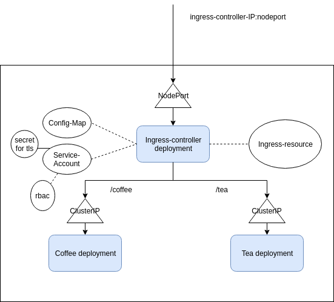

Either use

1) curl --resolve cafe.example.com:$IC_HTTPS_PORT:$IC_IP http://cafe.example.com:$IC_HTTPS_PORT/coffee --insecure

or

2) cafe.example.com:<nodeport>/tea in browser afgter adding ingresscontraoller's IP in /etc/hosts to resolve DNS 

For TLS use : https://www.digitalocean.com/community/tutorials/how-to-set-up-an-nginx-ingress-with-cert-manager-on-digitalocean-kubernetes

and https://www.youtube.com/watch?v=etC5d0vpLZE